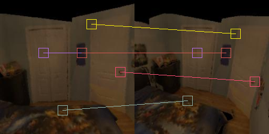

# Gator 🐊: Cross-view Ji**g**s**a**w Objec**t**ive f**or** Self-Supervised 3D Vision

## [Project Page]() | [🤗 Demo](https://huggingface.co/spaces/sevashasla2/gator)

> TL;DR: Cross-view jigsaw objective is an awersome pre-training task for 3D computer vision tasks

<p align="center">
  
</p>

*Abstract:* Current cross-view self-supervised methods for 3D vision commonly rely on pixel reconstruction, which can bias representations toward low-level appearance rather than the geometric correspondences required for downstream tasks such as relative pose and optical flow estimation. We introduce GATOR, a two-view jigsaw pretraining objective in which a Vision Transformer recovers the original positions of shuffled patches from one view by cross-attending to an unshuffled reference view. This formulation reframes pretraining as discrete patch-position classification rather than pixel-level reconstruction, encouraging the model to learn view-consistent geometric structure. Under matched compute, GATOR outperforms CroCo, single-view jigsaw, and MAE baselines on downstream transfer, demonstrating that geometry-centric pretraining objectives can produce stronger correspondence features than reconstruction-based alternatives.

## Installation ⚙️

1. Install [uv](https://docs.astral.sh/uv/getting-started/installation/)
2. Clone the repository 

```bash
git clone https://github.com/sevashasla/gator && cd gator
```

3. Install the requirements

```
uv venv && source .venv/bin/activate && uv sync --all-extras
```

**important** cuRoPE2D does not have backward implemented, so for training use the pytorch version instead.

## Pre-training 🧠

1. Generate dataset following the instructions [here](https://github.com/naver/croco/blob/master/datasets/habitat_sim/README.MD)
2. For Gator-Small run

  ```bash
  python3 gator/scripts/pretrainings/pretrain_gator.py \
    --model-config.enc-emb-dim 384 --model-config.enc-num-heads 6 \
    --model-config.dec-emb-dim 384 --model-config.dec-num-heads 6 \
    --opt-params.blr 1e-4 \
    --data-dir /path/to/rendered/dataset \
    --output-dir /root/to/store/the/results \
    --exp-name experiment-name
  ```

  To validate the pretraining model run

  ```bash
  python3 gator/scripts/test/test_gator.py \
      # should be /root/to/store/the/results/experiment-name/checkpoints/last.ckpt
      --ckpt-path /path/to/last.ckpt \ 
      --model-config.enc-emb-dim 384 --model-config.dec-emb-dim 384 \
      --model-config.enc-num-heads 6 --model-config.dec-num-heads 6 \
      --visualizer-config.name visual
  ```

3. For CroCo-Small run

  ```bash
  python3 gator/scripts/pretrainings/pretrain_croco.py \
    --exp-name croco-small-blr-1e-4-real \
    --opt-params.batch-size 128 \
    --opt-params.blr 1e-4 \
    --opt-params.max_epoch 50 \
    --opt-params.epochs 100 \
    --model_configuration "CroCoNet(enc_embed_dim=384, enc_depth=12, enc_num_heads=6, dec_embed_dim=384, dec_depth=8, dec_num_heads=6, mlp_ratio=4.0, pos_embed='RoPE100')" \
    --data-dir /path/to/rendered/dataset \
    --output-dir /root/to/store/the/results \
    --exp-name experiment-name
  ```

4. For MAE-Small run

  ```bash
  python3 gator/scripts/pretrainings/pretrain_mae.py \
    --model-config.enc-emb-dim 384 --model-config.enc-num-heads 6 \
    --model-config.dec-emb-dim 384 --model-config.dec-num-heads 6 \
    --data-dir /path/to/rendered/dataset \
    --output-dir /root/to/store/the/results \
    --exp-name experiment-name
  ```

5. For Jigsaw-Small run

  ```bash
  python3 gator/scripts/pretrainings/pretrain_jigsaw.py \
    --model-config.enc-emb-dim 384 --model-config.enc-num-heads 6 \
    --data-dir /path/to/rendered/dataset \
    --output-dir /root/to/store/the/results \
    --exp-name experiment-name
  ```

## Finetining on Downstream Tasks 🚀

### Classification

Download ImageNet-1K dataset

```bash
python3 gator/scripts/classification/load_imagenet.py \
    --output_dir /path/to/store/dataset \
    --splits validation \
    --shuffle_buffer 10000
```

Linear probe evaluation on ImageNet-1k: the backbone is frozen and a single linear head (`nn.Linear(embed_dim, 1000)`) is trained on top of the extracted features.

#### Gator / MAE

```bash
python3 -m gator.scripts.classification.imagenet_ft_gator \
    --checkpoint_path /path/to/checkpoint.ckpt \
    --data_dir /path/to/imagenet \
    --gator_config.enc_emb_dim 384 \
    --gator_config.enc_num_heads 6 \
    --gator_config.enc_depth 12 \
    --gator_config.dec_emb_dim 384 \
    --gator_config.dec_num_heads 6 \
    --opt_params.batch_size 512 \
    --opt_params.lr 1e-3 \
    --opt_params.max_epoch 25
```

#### CroCo

```bash
python3 -m gator.scripts.classification.imagenet_ft_croco \
    --checkpoint_path /path/to/checkpoint.ckpt \
    --data_dir /path/to/imagenet \
    --enc_embed_dim 384 \
    --enc_depth 12 \
    --enc_num_heads 6 \
    --opt_params.batch_size 512 \
    --opt_params.lr 1e-3 \
    --opt_params.max_epoch 25
```

#### Jigsaw

```bash
python3 -m gator.scripts.classification.imagenet_ft_jigsaw \
    --checkpoint_path /path/to/checkpoint.ckpt \
    --data_dir /path/to/imagenet \
    --model_name deit_small_patch16_224 \
    --batch_size 512 \
    --max_epochs 25 \
    --lr 1e-3
```

### Optical Flow

Optical flow is the task of estimating the dense 2D displacement field between two consecutive frames: for each pixel in the first image, the model predicts a vector `(u, v)` indicating where that pixel moved in the second image. The output is a `H × W × 2` field.

We finetune on a mix of MPI-Sintel and FlyingChairs and evaluate on the MPI-Sintel validation split (EPE metric).

```bash
python3 gator/stereoflow/train.py flow \
    --model        <croco|gator|mae|jigsaw_1view> \
    --pretrained   /path/to/pretrained.ckpt \
    --gator_config "enc_emb_dim=384,dec_emb_dim=384,enc_num_heads=6,dec_num_heads=6" \
    --oneview_config "enc_emb_dim=384,enc_num_heads=6" \
    --criterion    "LaplacianLossBounded()" \
    --dataset      "40*MPISintel('subtrain_cleanpass')+40*MPISintel('subtrain_finalpass')+4*FlyingChairs('train')" \
    --val_dataset  "MPISintel('subval_cleanpass')+MPISintel('subval_finalpass')" \
    --lr           2e-5 \
    --batch_size   16 \
    --epochs       50 \
    --img_per_epoch 30000 \
    --output_dir   /path/to/output
```

To evaluate a trained checkpoint on MPI-Sintel:

```bash
python3 gator/stereoflow/eval_flow.py \
    --model /path/to/checkpoint-best.pth \
    --split subval_cleanpass \
    --save
```

### Relative Pose Regression

Relative pose regression is the task of predicting the relative camera transformation (rotation and translation) between two images of the same scene. We finetune on the [7-Scenes](https://www.microsoft.com/en-us/research/project/rgb-d-dataset-7-scenes/) dataset and evaluate on the 7-Scenes test split (pose recall metric), following [Reloc3r](https://github.com/ffrivera0/reloc3r).

Preprocess the dataset to build image-retrieval pairs (cached in `_db-q_pair_info/`):

```bash
bash gator/scripts/relpose/preprocess_7scenes.sh
```

For Gator-Small run:

```bash
python3 gator/scripts/relpose/finetune_gator.py \
    --inner-model-ckpt-path /path/to/pretrained.ckpt \
    --model-config.enc-emb-dim 384 \
    --model-config.dec-emb-dim 384 \
    --model-config.enc-num-heads 6 \
    --model-config.dec-num-heads 6 \
    --exp-name experiment-name \
    --output-dir /path/to/output
```

Analogous scripts exist for CroCo (`finetune_croco.py`), MAE (`finetune_mae.py`), and Jigsaw (`finetune_jigsaw.py`). By default the encoder/decoder is frozen and only the pose head is trained.

To evaluate a trained checkpoint on 7-Scenes:

```bash
python3 gator/scripts/relpose/eval_gator.py \
    --inner-model-ckpt-path /path/to/pretrained.ckpt \
    --model-config.enc-emb-dim 384 \
    --model-config.dec-emb-dim 384 \
    --model-config.enc-num-heads 6 \
    --model-config.dec-num-heads 6 \
    --ckpt-path /path/to/last.ckpt
```

## Reference View Utilization

### Zero Reference

Run

```bash
python3 gator/scripts/gator_multiview_usage/by_zeroing.py \
    --ckpt-path /path/to/last.ckpt \
    --output-path /where/to/store/by_zeroing.csv \
    --model-config.enc-emb-dim 384 --model-config.dec-emb-dim 384 \
    --model-config.enc-num-heads 6 --model-config.dec-num-heads 6 \
    --shuffle_ratios 0.05 0.1 0.2 0.3 0.4 0.5 0.6 0.7 0.8 0.9 0.95
```

The script creates a `by_zeroing.csv` file with results when passing the actual reference image and a zero image instead of the reference for different masking ratios.

### Tiny Dataset

Run

```bash
python3 gator/scripts/gator_multiview_usage/by_twin_images.py \
    --ckpt-path /path/to/last.ckpt \
    --exp-name exp-used-to-generate \
    --model-config.enc-emb-dim 384 --model-config.dec-emb-dim 384 \
    --model-config.enc-num-heads 6 --model-config.dec-num-heads 6
```

The script creates `twin_images_*.png` with reshuffling resuls and swapped object patches accuracy in `twin_images_accuracy.txt`. The idea of the method is discussed in [./docs/two_view.md](./docs/two_view.md)

## Cross-Attention

1. Extract q, k, v and batch images
  ```bash
  python3 gator/scripts/features_exploration/attention_maps.py \
    --ckpt-path /path/to/last.ckpt \
    --model-config.enc-emb-dim 384 --model-config.enc-num-heads 6 \
    --model-config.dec-emb-dim 384 --model-config.dec-num-heads 6 \
    --output-dir  /folder/to/store/qkv/ \
    # save only cross-attention features
    --ca-only \
    # how many eval batches to run and save
    --num-batches 10
  ```

  It produces folders /folder/to/store/qkv/batch_{chosen_idx:03}, with stored `qkv` and `input_batch.pth`

2. Create an image grid (not necessary, but easier to understand what patches to take in the next step)

  ```bash
  python3 gator/scripts/features_exploration/show_image_grid.py \
    --input_folder /folder/with/stored/qkv/batch \
    # image_indices can be any set with numbers from 0 to batch_size - 1
    --image-indices 0 5 112 3 58 \
    # whether to show shuffled image or reference image
    --no-reference \
    --output_dir /folder/to/store/the/results
  ```


3. Create an image with shown matches

  ```bash
  python3 gator/scripts/features_exploration/cross_attn_vis2.py \
    --input_folder /folder/with/stored/qkv/batch \
    --output_dir /where/to/store/the/resulting/image \
    --image_index image_index \
    # in format y x y x y x ...
    --patches_positions 5 4 7 5 7 10 1 9 7 7 6 3 \
    # use _decoder_blocks.3.cross_attn-000.pth or _decoder_blocks.4.cross_attn-000.pth
    # the later blocks (5 or 6) do not have the matching feature
    --attention_file _decoder_blocks.4.cross_attn-000.pth
  ```

<p align="center">
  
</p>

## File Hierarchy 📚


```
project-root/
├── README.md — Project overview and setup instructions.
├── docs/ - Documentation folder
│   ├── two_view.md - description for experiments testing whether Gator uses the reference view
│   ├── diffusion_editing/ - uses a TinyDataset of 15 images, where for each image we can swap some of its patches and resulting image still looks realistic
│   └── visual_anagrams/ - initially we experimented generating those images fully with diffusion models and swapping of large portion of patches, but it did not work since patches border were visible.
│
│
├── assets/ - images used for README.md
├── gator/ - the main folder with code
│   ├── datasets/ - generate dataset (derived and adapted from CroCo)
│   │   ├──  shard/ - shard the dataset
│   │   │   ├── create_shards.py - construct shards from raw dataset
│   │   │   └── transforms.py - data transformation and augmentations for training
│   │   └── other files derived from CroCo
│   │
│   ├── models/
│   │   ├── gator_2view/ - Gator model implementation
│   │   ├── gator_losses/ - Jigsaw objectives
│   │   ├── gator_visualizer/ - Classes to visualize models predictions
│   │   ├── jigsaw_1view/ - Jigsaw model implementation
│   │   ├── mae_1view - MAE model implementation
│   │   ├── croco_wrapper.py - CroCo PyTorch Lightning wrapper
│   │   └── other files derived from CroCo
│   │
│   ├── relpose/ - relative pose estimation module (based on Reloc3r)
│   │   ├── datasets/ - 7-Scenes dataset loaders and retrieval datasets
│   │   ├── image_retrieval/ - NetVLAD-based top-k retrieval
│   │   ├── models/ - per-backbone relpose wrappers (Gator, CroCo, MAE, Jigsaw)
│   │   ├── utils/ - geometry, metric, and image utilities
│   │   └── loss.py - L21 / relative camera pose regression loss
│   │
│   ├── scripts/ - 
|   |   ├── classification/- finetune (gator, jigsaw, croco, MAE) for classification
│   │   ├── features_exploration/ - extract and analyze attention maps
│   │   ├── gator_multiview_usage/ - test whether Gator uses the reference view
│   │   ├── pretrainings/ - pretraing models (Gator, Jigsaw, CroCo, MAE)
│   │   ├── pretrainings_ddp/ - pretraing models (Gator, Jigsaw, CroCo, MAE) on multiple GPUs
│   │   ├── relpose/ - scripts to finetune models on Relative Pose Estimation task
│   │   ├── show/ - visualize predictions for Gator, CroCo, MAE
│   │   └── test/ - calculate metrics for Gator and Jigsaw
│   │
│   ├── stereoflow/ - finetuning and evaluation on optical flow and stereo disparity
│   │   ├── train.py - main training script (supports CroCo, Gator, MAE, Jigsaw backbones)
│   │   ├── test.py - tiled inference and metric evaluation
│   │   ├── eval_flow.py - optical flow evaluation with visualisations on MPI-Sintel
│   │   ├── engine.py - training loop (loss, optimiser step, wandb/tensorboard logging)
│   │   ├── criterion.py - Laplacian loss variants for flow and stereo
│   │   ├── datasets_flow.py - flow datasets (MPI-Sintel, FlyingChairs, …)
│   │   ├── datasets_stereo.py - stereo datasets (KITTI, ETH3D, Middlebury, …)
│   │   └── README.MD - detailed dataset setup and CroCo-Stereo/Flow training commands
│   │
│   ├── utils/ - helpful functions, derived from CroCo
│   ├── __init__.py - contains logger
|   └── other files derived from CroCo 
|   
├── .gitignore
├── .python-version
├── pyproject.toml - dependencies
└── uv.lock - used versions of dependencies
```

## Acknowledgements

We thank the authors of [`CroCo`](https://github.com/naver/croco) and [`Reloc3r`](https://github.com/ffrivera0/reloc3r) for their amazing works!
